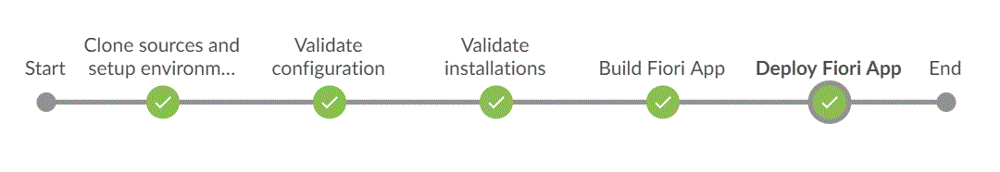

# Jenkinsfile for SAPUI5 or SAP Fiori Development on SAP Cloud Platform

The `Jenkinsfile` in this folder is part of project "Piper". It will help you to implement a Continuous Integration pipeline for SAPUI5 development in Jenkins. The pipeline includes building and deploying the application to SAP Cloud Platform.

To use it, you need to provide the following files for which [templates][piper-pipelines-fiori] are available in the GitHub repository of this project into the root folder of your SAPUI5 or SAP Fiori application (parallel to the `webapp` folder):

* `.pipeline/config.properties`: Holds properties needed for building the pipeline, for example proxy settings (if needed), and connection data for SAP Cloud Platform. Enter the values specific for your project (see also the tool installation steps below).
* `.npmrc`: Defines npm config settings, e.g. registries for downloading npm packages.
* `Gruntfile.js`: Contains the tasks executed in the build (linting, minification and preload generation). This file does not need to be changed.
* `package.json`: Contains the metadata of your application as npm project. You must maintain the application name and version here.
* `mta.yaml`: Contains the metadata of the MTA package to be deployed. You must maintain the application name and version here.

# Prerequisites

To run the `Jenkinsfile`, you need to configure the [shared library](http://github.com/SAP/jenkins-library) in your Jenkins master. This library contains step and utility implementations that are required in the pipeline.

Some additional tools must be installed on the build node. These are:

* Java JRE 1.8.0. Environment variable `JAVA_HOME` needs to be set.
* Node.js and npm.
* The MTA Archive Builder, version 1.0.6 or higher. You may download it from [SAP ONE Support Launchpad](https://launchpad.support.sap.com/): navigate to Software Downloads, search for MTA Archive Builder and download the newest version. Install it on the build machine (or build node). The Jar archive must have the name `mta.jar`. Provide the directory where it is installed as property `MTA_HOME` in `.pipeline/config.properties`.
* The SAP Cloud Platform Neo command line client. Get version 3.39.10 or newer from (http://central.maven.org/maven2/com/sap/cloud/neo-java-web-sdk) and unpack the zip file to a location on the build machine. Provide the unpacked directory as property `NEO_HOME` in `.pipeline/config.properties`.

For automatic deployment of the application to the SAP Cloud Platform account, logon credentials are needed. Maintain them in the central Jenkins configuration (Manage Jenkins > Credentials). Provide the credentials ID as property `neoCredentialsId` in `.pipeline/config.properties`.

# Pipeline Stages

The pipeline consists of the following stages:

## Stage: Clone Sources and Setup Environment

In this stage the pipeline initializes the pipeline environment, fetches the application sources, and reads the `.pipeline/config.properties`. All of the following stages depend on this initial stage. If you plan to modify the pipeline, keep this stage at the beginning.

## Stage: Validate Configuration

This stage checks the configuration that is required for the subsequent pipeline stages.

## Stage: Validate Installations

This stage checks for the tools that are required for the pipeline. The pipeline configuration allows you to specify the location of these tools.

## Stage: Build Fiori App
This stage builds the SAPUI5 application, i.e., it creates an `mtar` archive of the application that can be deployed to SAP Cloud Platform. See the [`mtaBuild` step documentation][piper-library-step-mtabuild] for details and prerequisites. 

## Stage: Deploy Fiori App
This stage deploys the application to the SAP Cloud Platform account, using `DEPLOY_HOST`, `CI_DEPLOY_ACCOUNT` and `neoCredentialsId` from `.pipeline/config.properties`. See the [`neoDeploy` step documentation][piper-library-step-neodeploy] for details and prerequisites.

[piper-pipelines]: https://github.com/SAP/jenkins-pipelines   
[piper-pipelines-fiori]: https://github.com/SAP/jenkins-pipelines/tree/master/pipelines/ui5-sap-cp
[piper-library-step-mtabuild]: https://sap.github.io/jenkins-library/steps/mtaBuild
[piper-library-step-neodeploy]: https://sap.github.io/jenkins-library/steps/neoDeploy/
